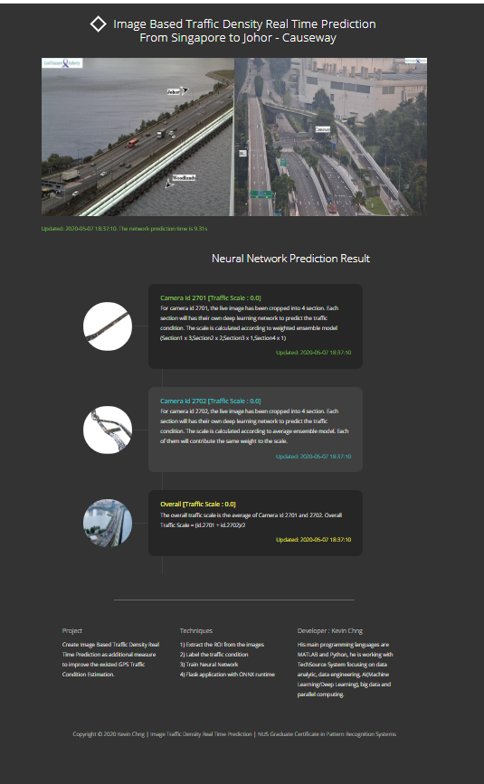

---

## SECTION 1 : PROJECT TITLE
## Image Based Traffic Density Real Time Prediction using SG LTA Traffic Cameras

Authors : Kevin Chng (Email Address : kevinchng@hotmail.com)

---
## SECTION 2 : REQUIREMENTS

---
## SECTION 3 : EXECUTIVE SUMMARY / PAPER ABSTRACT
There are many route planning apps in the market. Some help their users plan their trips by using maps to find the shortest path. However, if real traffic conditions are not 
factored in, even if they use the most accurate map available, frequently what appeared to be the faster route ends taking up a much longer time than anticipated.

Other route planning apps tried to overcome this issue by having their users turn on GPS. Based on the accumulated users' GPS in specific location, the app can "see" the traffic density there. In addition to this, some apps also incorporate traffic reports and tweets into their optimization model.

However, these methods depend on the user agreeing to turn on their GPS and tweeting about traffic conditions. Some users may wish to use the app in an offline mode and not turn on their GPS due to privacy concerns, and we cannot depend on users to always tweet about traffic situation consistenly and in every instance. How many users are displined or motivated to call in traffic report after report, day after day. Moreover, categorization of traffic density is subjective. One user's definition of heavy traffic is what another deem to be normal traffic

In Singapore, there are around 87 LTA traffic cameras installed all over the island. By utilizing the LTA traffic cameras to measure traffic density, we providue an addition method of providing traffic density that is not dependent on users' GPS and reports.

My goal is not to replace route planning apps but to provide a serice as assistance which they can use to improve the existed route planning.

At the end, I have developed a real-time web application to predict the causeway traffic density using Falsk framework and trained CNN nueral network.

As this is a proof-of-concept and not the full-blown implementation, the trained neural network is not able to recognize other road's traffic condition and it is only applicable on JB-SG causeway
 
---
## SECTION 4 : DATASET
Data.gov.sg allows user to extract real-time and historical traffic images from the link below :
https://data.gov.sg/dataset/traffic-images

There are LTA traffic cameras installed all over Singapore to capture the traffic images, and the databases are open for public to access.

     
However, in this project, i'm only focusing on SG-JB causeway traffic. Therefore, I extract 1 month data (Jan 2020) from two traffic cameras installed near the JB-SG causeway, and later I manually label the data to categorize them into "traffic Jam" and "Not Traffic Jam"

---
## SECTION 5 : MILESTONE 
You can either use Python or MATLAB if they are available

| Milestone  | Title  | Python Script | MATLAB Script | 
| :------------ |:---------------:| :-----| :-----| 
| 1 | Exploring the Data | Milestone_1_Explore Data.py  Explore Data.ipynb  Milestone1_Save_Data.py| Milestone_1_Explore_Data_and_Save_Data.mlx |
| 2 | Extracting ROI from Images | Milestone2_Extract ROI from Image_2701.py  Milestone2_Extract ROI from Image_2702.py | Milestone_2_Extract_ROI_from_Image.mlx |
| 3 | Crop the Image and Label the Traffic Condition | | Milestone_3_Crop2701.mlx  Milestone_3_Crop2702.mlx | 
| 4 | Train Deep Learning Models | | Milestone_4_Transfer_Learning_2701.mlx  Milestone_4_Transfer_Learning_2702.mlx |
| 5 | Export Network to ONNX Models | | Export Model to ONNX | 
| 6 | Build Ensemble Network | Milestone_6_Inferences.mlx | Milestone_6_Inferences.mlx |  
| 7 | Flask - Web Service Deployment | | Flask |

For detail techniques, please refer to https://github.com/KevinChngJY/trafficmonitoring/blob/master/milestone_technique.md

---
## SECTION 6 : VIDEO OF SYSTEM MODELLING & USE CASE DEMO

[

---
## SECTION 7 : USER GUIDE

### To run the system in local machine

Install Anaconda & create new environment 

First ensure you have all dependencies :
* Flask : https://anaconda.org/anaconda/flask
* Urllib3 : https://anaconda.org/conda-forge/urllib3
* Json : https://anaconda.org/jmcmurray/json
* Onnxruntime : https://pypi.org/project/onnxruntime/
* Opencv : https://anaconda.org/conda-forge/opencv
* Numpy : https://anaconda.org/anaconda/numpy
* Matplotlib : https://anaconda.org/conda-forge/matplotlib
* Pillow :  https://anaconda.org/anaconda/pillow

Prepare back-end of the service
1. Open up your command prompt/terminal
2. Do ``git clone`` https://github.com/KevinChngJY/trafficmonitoring
3. Go into the ‘Milestone 7 Flask’ folder
4. Run ``python main.py`` in the anaconda prompt
5. Now back-end is deployed on *http://127.0.0.1:5000/*
6. Open the link above in the browser to visualize the real-time prediction

---
