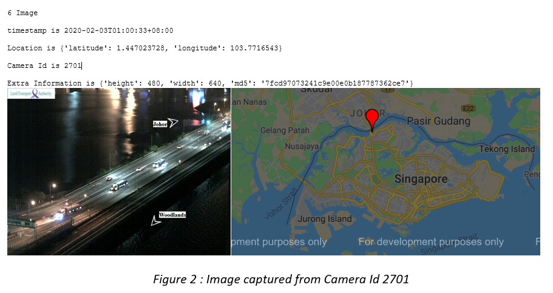
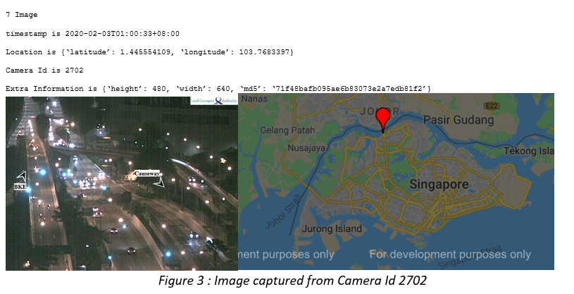
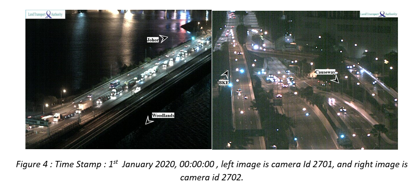
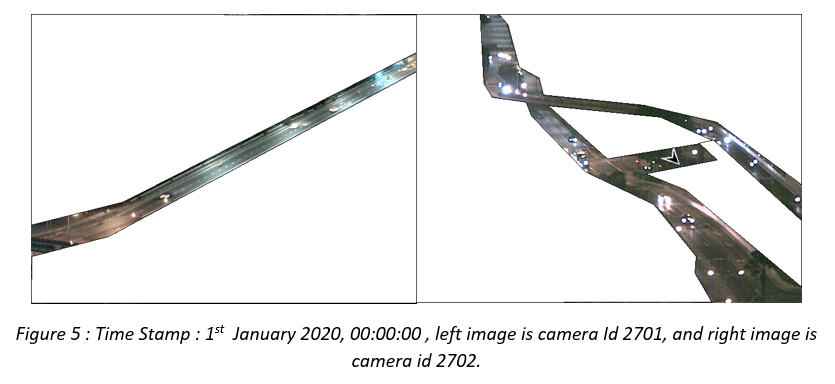
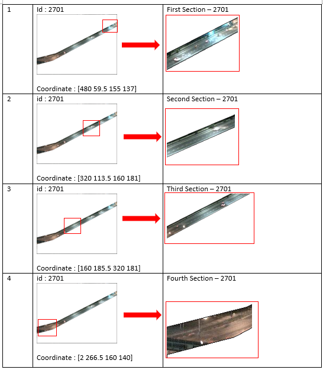
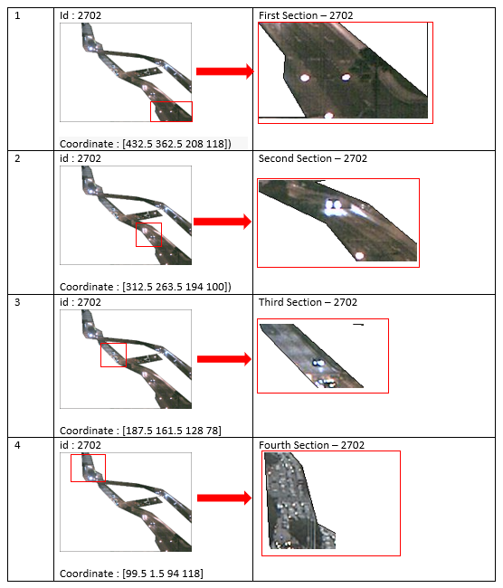
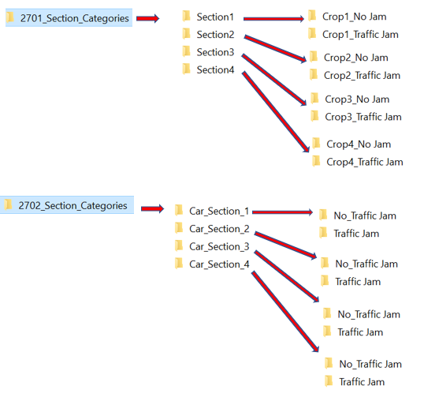
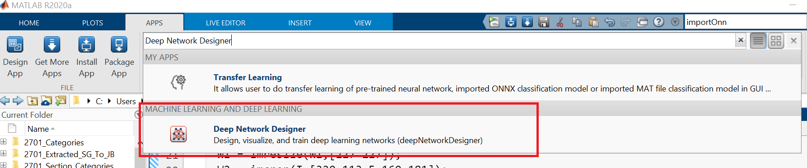
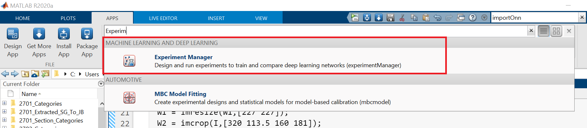

## MILESTONE 1 : Exploring the Data

In this milestone, we are going to explore API provided by Data.gov.sg. Subsequently, we will screen the dataset and select the bestv location to do "Traffic Condition Classification". For individual location, it will return us the parameter as below:

1) Timestamp
2) Location (latitude and longitude)
3) Camera Id
4) Height and Width of the Image

As definition of trafic condition is subjective, one user's definition of heavy traffic is what another would deem to be normal traffic. besides, high traffic flow does not mean that the road is having traffic jam. Having said that, there might be high density of vehicle in the road, but they are moving smoothly without encountering the traffic jam. With all these considerations, I decide to select causeway for my project. As every vehicle must be stopped and checked by the custom oficer, and this process is likely using the same duration for each vehcle. Therefore, the definition of traffic jam is relatively easier to be defined. For causeway, if there are high density of vehicles, it is defnitely that we must queue longer time to cross the checkpoint.

As a result, the two causeway cemeras (id:2701 and id:2702) are selected.

In this milestone, the tools and scripts are
| Interpreter | **Python (Jupyter Notebook & Spyder)**  | **MATLAB R2020a** |
| :------------ |:---------------:|:---------------:|
| Packages/Toolboxes | urlib3 json gmplot os requests shutil | Mapping Toolbox |
| Script | **Milestone 1 Explore Data.ipynb or Milestone 1 Explore Data.py**  Visualize the data   **Milestone 1 Save Data.py**   Download the dataset| **Milestone_1_Explore_Data_and_Save_Data.mlx**  Visualize and Save the data|

---
## Milestone 2 : Extracting ROI from Images and Crop the Image into few section
In this section, we segmented the road out for all the images in the folder dataset/2701 and dataset/2702

Original :

     
Segmented the road out :

     
| Interpreter | **Python (Spyder)**  | **MATLAB R2020a** |
| :------------ |:---------------:|:---------------:|
| Packages/Toolboxes | labelme(third party tool) from PIL import image ImageDraw json os | Image Processing Toolbox |
| Script | **Third Party Tool - labelme** label the coordinate of image 2701 and 2702,   save them to 2701_coordinate.json abd 2702_coordinate.json **Milestone_2_Extract ROI from Image_2701.py** and **Milestone_2_Extract ROI Image_2702.py**   Segment/Mask ROI from all the images| **Milestone_2_Extract_ROI_from_Image.mlx**  Segment/Mask ROI from all the images|

---
## Milestone 3 : Crop the Images into 4 section and Label the traffic condition
If you are looking at the quality of images, then you will discover that the image's quality is bad. Therefore, it is not recommended to rescale the image into smaller image for the inout of deep learning neural network, As a result, I crop the image as follows:

**Camera id 2701**
I crop the image into 4 sections

**Camera id 2702**
I crop the image into 4 sections

     
We will crop the images into 4 section, then in each section, I manually label them into traffic jam or not traffic jam.
At the end of this milestone, we have labelled dataset as follow:

---
## Milestone 4 : Train Neural Network (Deep Learning) - Transfer Learning
In this milestone, we will train neural networks at different sections and later discover how to ensemble the outcome of different neural networks.

I use MATLAB's Deep Network Designer to train the neural network and fine tune the hyperparameter using Experiment Manager (R2020a). Deep Network Designer and Experiment Manager are GUI applications in MATLAT latest release R2020a.

(In future, perhaps I will add python script about it, but it is not hard, you can grab example online)

How to open Deep Network Designer in MATLAB:

     
How to open Experiment Manager in MATLAB:

