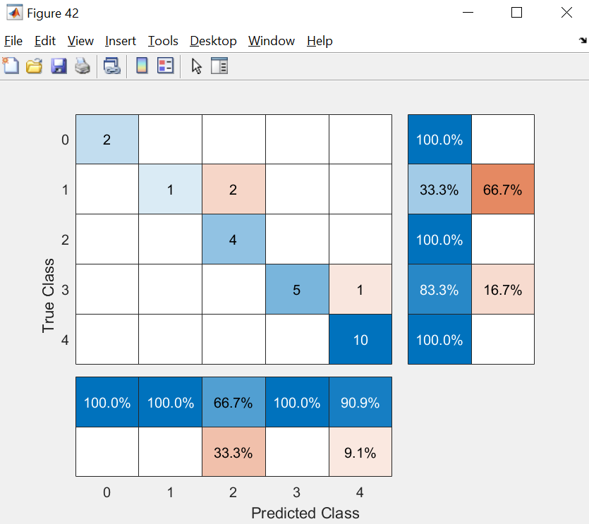

## MILESTONE 1 : Exploring the Data

In this milestone, we are going to explore API provided by Data.gov.sg. Subsequently, we will screen the dataset and select the bestv location to do "Traffic Condition Classification". For individual location, it will return us the parameter as below:

1) Timestamp
2) Location (latitude and longitude)
3) Camera Id
4) Height and Width of the Image

As definition of trafic condition is subjective, one user's definition of heavy traffic is what another would deem to be normal traffic. besides, high traffic flow does not mean that the road is having traffic jam. Having said that, there might be high density of vehicle in the road, but they are moving smoothly without encountering the traffic jam. With all these considerations, I decide to select causeway for my project. As every vehicle must be stopped and checked by the custom oficer, and this process is likely using the same duration for each vehcle. Therefore, the definition of traffic jam is relatively easier to be defined. For causeway, if there are high density of vehicles, it is defnitely that we must queue longer time to cross the checkpoint.

As a result, the two causeway cemeras (id:2701 and id:2702) are selected.

In this milestone, the tools and scripts are
| Interpreter | **Python (Jupyter Notebook & Spyder)**  | **MATLAB R2020a** |
| :------------ |:---------------:|:---------------:|
| Packages/Toolboxes | urlib3 json gmplot os requests shutil | Mapping Toolbox |
| Script | **Milestone 1 Explore Data.ipynb or Milestone 1 Explore Data.py**  Visualize the data   **Milestone 1 Save Data.py**   Download the dataset| **Milestone_1_Explore_Data_and_Save_Data.mlx**  Visualize and Save the data|

---
## Milestone 2 : Extracting ROI from Images and Crop the Image into few section
In this section, we segmented the road out for all the images in the folder dataset/2701 and dataset/2702

Original :

     
Segmented the road out :

     
| Interpreter | **Python (Spyder)**  | **MATLAB R2020a** |
| :------------ |:---------------:|:---------------:|
| Packages/Toolboxes | labelme(third party tool) from PIL import image ImageDraw json os | Image Processing Toolbox |
| Script | **Third Party Tool - labelme** label the coordinate of image 2701 and 2702,   save them to 2701_coordinate.json abd 2702_coordinate.json **Milestone_2_Extract ROI from Image_2701.py** and **Milestone_2_Extract ROI Image_2702.py**   Segment/Mask ROI from all the images| **Milestone_2_Extract_ROI_from_Image.mlx**  Segment/Mask ROI from all the images|

---
## Milestone 3 : Crop the Images into 4 section and Label the traffic condition
If you are looking at the quality of images, then you will discover that the image's quality is bad. Therefore, it is not recommended to rescale the image into smaller image for the inout of deep learning neural network, As a result, I crop the image as follows:

**Camera id 2701**
I crop the image into 4 sections

**Camera id 2702**
I crop the image into 4 sections

     
We will crop the images into 4 section, then in each section, I manually label them into traffic jam or not traffic jam.
At the end of this milestone, we have labelled dataset as follow:

| Interpreter | **Python**  | **MATLAB R2020a** |
| :------------ |:---------------:|:---------------:|
| Packages/Toolboxes |  |  |
| Script | | **Milestone_3_Crop2701.mlx** and **Milestone_3_Crop2702.mlx**  Crop 4 regions/sections and place them into different folders|

---
## Milestone 4 : Train Neural Network (Deep Learning) - Transfer Learning
**if you dont want to train the models yourself, you may skip the training process**
**in Milestone 6, there is link to download trained model for this project**

In this milestone, we will train neural networks at different sections and later discover how to ensemble the outcome of different neural networks.

I use MATLAB's Deep Network Designer to train the neural network and fine tune the hyperparameter using Experiment Manager (R2020a). Deep Network Designer and Experiment Manager are GUI applications in MATLAT latest release R2020a.

(In future, perhaps I will add python script about it, but it is not hard, you can grab example online)

How to open Deep Network Designer in MATLAB:

     
How to open Experiment Manager in MATLAB:

     
At the end of this milestone, there are
4 Neural Networks for different sections in 2701
4 Neural Networks for different sections in 2702

| Interpreter | **Python**  | **MATLAB R2020a** |
| :------------ |:---------------:|:---------------:|
| Packages/Toolboxes |  | Deep Learning Toolbox  |
| Script | | **Milestone_4_Transfer_learning_2701.mlx** and **Milestone_4_Transfer_learning_2702.mlx**  Train CNN using Transfer Learning|

---
## Milestone 5 : Export Network to ONNX Model
ONNX is an open format built to represent machine learning/deep learning models. ONNX defines a common set of operators – the building blocks of machine learning and deep learning models and a common file format to enable AI developers to use models with variety of frameworks, tools, runtimes, and compilers. For more details, you can refer to website below:

https://onnx.ai/

In this milestone, we export the neural network from MATLAB to ONNX model using MATLAB function ([exportONNXNetwork](https://www.mathworks.com/help/deeplearning/ref/exportonnxnetwork.html)). Therefore, after exporting all the eight model to ONNX, then we should have 8 ONNX files:

     
If you refer to ONNX website, there are few deployment options you may consider. However, for this  project, we will use ONNX runtime in python.

---
## Milestone 6 : Build Ensemble Models from our 8 CNN trained Network
**If you didn't train the model yourself, you may download the trained model here : https://www.dropbox.com/s/k2vza349bspvmvn/ONNX%20Network.zip?dl=0**

Ensemble models will combine the decisions from multiple models to improve the overall performance. There are various ensemble models techniques as follows:

1)	Simple Ensemble Techniques
•	Taking the mode of the results
•	Taking the average of the results
•	Talking weighted average of the results
2)	Advanced Ensembled Techniques
•	Bagging (Bootstrap AGGregatING)
•	Boosting

In this project, I would like to classify the traffic jam scale from 0-4. After running through few predictions, I found section 3 and section 4 of id 2701 usually cause confusion and return low accuracy of prediction, it is because the custom officer sometimes will allow heavy vehicles from opposite direction to use one of the lane JB to queue for Singapore Custom, therefore, the neural network miss classify it as traffic jam or higher score for traffic jam. 
	
For example, in the image below, we found the traffic score is higher at section 3 due to the opposite heavy vehicle (from JB to SG) is queuing the Singapore’s Custom.

As a result, I put lower weight for section 3 and section 4 in images 2701. For the image 2702, I will take the summation of all traffic jam’s scores as the scale of traffic.

**Weightage of each section to form the ensemble model for each image**

For the evaluation of these 2 ensemble models, I randomly select 25 images to predict the traffic condition using trained neural network. Through trial and errors, they are the best ensemble model (weightage). However, in future development, perhaps we should build an optimization model to optimize the weightage.

The result of the evaluation (25 images) is showing in the confusion matrix below

For 2701 : Overall Accuracy is 88%

     
For 2702: Overall Accuracy is 88%

At the end, I average the traffic jam scale of 2 ensemble model as final traffic scale.

**Overall Traffic Jam Scale = (Traffic Jam Scale of 2701 Ensemble Model + Traffic Jam Scale of 2702 Ensemble Model) / 2**

| Interpreter | **Python**  | **MATLAB R2020a** |
| :------------ |:---------------:|:---------------:|
| Packages/Toolboxes | numpy onnxruntime from onnx import numpy_helper urllib.request time opencv(cv2) time matplotlib.pyplo from PIL import Image, ImageDraw, ImageFont | Deep Learning Toolbox  |
| Script | **Milestone_6_ONNX_RunTime_Testing_Spyder.py** Testing ONNX runtime + Evaluate Ensemble Model | **Milestone_6_Inferences.mlx**  Evaluate Ensemble Model|

---
## Milestone 7 : Flask - Web Service Deployment
The figure below is the overview of system implementation in this project. I use flask to run as backend service to get the latest traffic image from Data.gov.sg through restAPI. The installed ONNX runtime will load the trained ONNX models and keep the model as ONNX session to classify the latest traffic image. The web application will request the latest traffic scale result from the server, and reflect them in the frontend (Web Page). There are 8 ONNX models loading into the flask backend.

     
**To run the system in local machine**
Install Anaconda & create new environment 

First ensure you have all dependencies :
* Flask : https://anaconda.org/anaconda/flask
* Urllib3 : https://anaconda.org/conda-forge/urllib3
* Json : https://anaconda.org/jmcmurray/json
* Onnxruntime : https://pypi.org/project/onnxruntime/
* Opencv : https://anaconda.org/conda-forge/opencv
* Numpy : https://anaconda.org/anaconda/numpy
* Matplotlib : https://anaconda.org/conda-forge/matplotlib
* Pillow :  https://anaconda.org/anaconda/pillow

Prepare back-end of the service

Prepare back-end of the service
1. Download trained ONNX Models (8 Models) and place them in the folder of Coding(Submission)
https://www.dropbox.com/s/k2vza349bspvmvn/ONNX%20Network.zip?dl=0 
2. Open up your command prompt/terminal
3. Do ``git clone`` https://github.com/KevinChngJY/trafficmonitoring
4. Go into the ‘Milestone 7 Flask’ folder
5. Run ``python main.py`` in the anaconda prompt
6. Now back-end is deployed on *http://127.0.0.1:5000/*
7. Open the link above in the browser to visualize the real-time prediction
